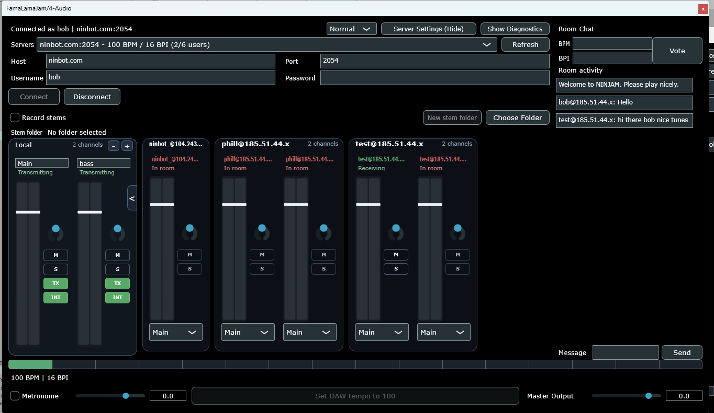
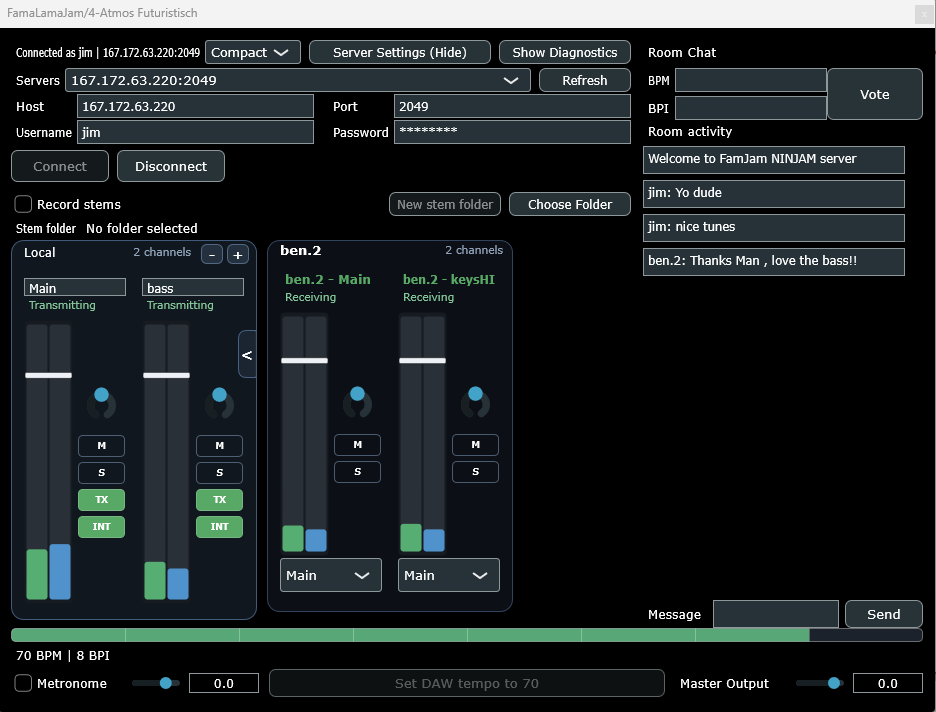

# FamaLamaJam

FamaLamaJam is a JUCE-based NINJAM client plugin for DAWs. It gives you a strip-first rehearsal mixer, room chat, transport tools, remote output routing, and stem capture inside a plugin window instead of a separate app.

Current plugin formats:

- Windows: `VST3`
- macOS: `VST3` and `AU`

Downloads are published on the [GitHub Releases](https://github.com/TomDirkKnee/FamaLamaJam/releases) page.

## What It Does

- Connect to public or private NINJAM servers from inside the plugin
- Mix local sends and remote players in a compact channel-strip view
- Route remote users to different plugin outputs
- Use room chat and room activity without leaving the DAW
- Vote room `BPM` and `BPI` from the plugin UI
- Use built-in metronome, transport progress, and host-sync assist tools
- Capture stems for local and remote interval audio
- Switch between `Normal` and `Compact` UI sizes depending on room size

## Screenshots

### Normal View

Connected view with local channels, grouped remote users, room chat, and the full transport footer.



### Compact View

Compact mode keeps the same mixer strips but reduces the main shell width for smaller sessions.



## Install

Download the latest release assets from the [Releases](https://github.com/TomDirkKnee/FamaLamaJam/releases) page.

### Windows

1. Download `FamaLamaJam-<version>-windows-vst3.zip`.
2. Unzip it.
3. Copy `FamaLamaJam.vst3` to one of these folders:
   - System-wide: `C:\Program Files\Common Files\VST3\`
   - Per-user: `%LOCALAPPDATA%\Programs\Common\VST3\`
4. Rescan plugins in your DAW if needed.

The Windows release build is packaged to avoid needing a separate Visual C++ runtime install.

### macOS

1. Download the asset you need:
   - `FamaLamaJam-<version>-macos-vst3.zip`
   - `FamaLamaJam-<version>-macos-au.zip`
2. Unzip it.
3. Copy the plugin bundle to the matching folder:
   - VST3 system-wide: `/Library/Audio/Plug-Ins/VST3/`
   - VST3 per-user: `~/Library/Audio/Plug-Ins/VST3/`
   - AU system-wide: `/Library/Audio/Plug-Ins/Components/`
   - AU per-user: `~/Library/Audio/Plug-Ins/Components/`
4. Rescan plugins in your DAW if needed.

## Quick Start

1. Insert FamaLamaJam on a track in your DAW.
2. Choose a public room or enter a host and port manually.
3. Set your username and connect.
4. Use the local strips to manage what you transmit.
5. Mix remote users with the strip controls and output selectors.
6. Use room chat, BPM/BPI voting, and the transport footer while rehearsing.

## Build From Source

Requirements:

- CMake `3.24+`
- A C++20 compiler
- Visual Studio 2022 on Windows or Xcode on macOS

Example:

```powershell
cmake -B build -G "Visual Studio 17 2022" -A x64
cmake --build build --config Release --target famalamajam_plugin_VST3
```

The project also includes GitHub Actions workflows for:

- normal CI builds on Windows and macOS
- tagged release packaging and GitHub Release uploads

## Project Status

Release `v0.1.0` is the first tagged packaged release with:

- Windows `VST3`
- macOS `VST3`
- macOS `AU`

Future polish areas include broader documentation, distribution polish, and additional workflow refinements.
